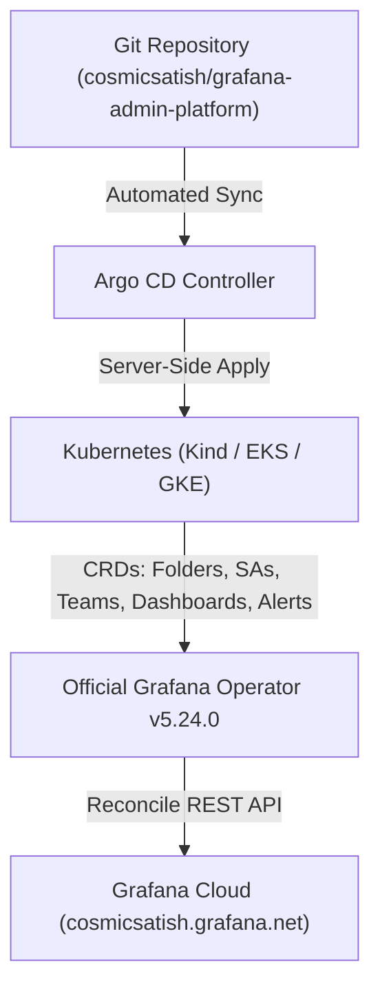

# Grafana Admin Platform (GitOps)

Enterprise declarative GitOps management platform for **Grafana Cloud** utilizing **Argo CD** and the official **Grafana Operator (`v5.24.0`)**.

---

## 🏛️ Architecture Overview



---

## 📁 Repository Structure

```text
.
├── chart/                              # Master Declarative Helm Chart
│   ├── templates/                      # Standardized Kubernetes CRD templates
│   │   ├── Grafana.yaml                # Target Grafana Cloud Instance CR
│   │   ├── GrafanaFolder.yaml          # Hierarchical Folders (Osttra + 41 Subfolders)
│   │   ├── GrafanaServiceAccount.yaml  # Service Accounts (Least Privilege role: None)
│   │   ├── Team.yaml                   # 39 Teams & Azure AD Group Mapping
│   │   ├── TeamLBACRule.yaml           # Loki LBAC Stream Selectors
│   │   ├── ResourcePermission.yaml     # Datasource & Resource Permissions
│   │   ├── GrafanaDashboard.yaml       # Zero-Config Dashboard Glob Auto-Discovery
│   │   ├── GrafanaAlertRuleGroup.yaml  # Zero-Config Alert Rule Group Glob Auto-Discovery
│   │   └── _helpers.tpl                # Shared label & selector helpers
│   │
│   └── values/                         # Declarative Values (Single Source of Truth)
│       ├── Team.yaml                   # 39 Teams & Role Definitions
│       ├── GrafanaFolder.yaml          # 42 Nested Folders & Access Control Lists
│       ├── GrafanaServiceAccount.yaml  # 19 SAs with Fine-Grained Fixed Roles
│       ├── TeamLBACRule.yaml           # 25 Loki LBAC Stream Selectors
│       └── ResourcePermission.yaml     # Datasource Permissions
│
├── deploy/
│   ├── alloy/                          # Grafana Alloy Telemetry Pipeline
│   │   └── values.yaml                 # Scrapes Operator :9090 & Remote Writes to Prometheus
│   ├── argocd/                         # Argo CD GitOps Declarations
│   │   ├── application.yaml            # Argo CD Application Definition
│   │   └── project.yaml                # Argo CD AppProject
│   ├── operator-values.yaml            # Official Grafana Operator Helm configuration
│   └── install.sh                      # Cluster bootstrap and installer script
│
├── policy/
│   └── security.rego                   # Open Policy Agent (OPA) Conftest guardrails
│
├── .github/workflows/
│   ├── validate.yaml                   # CI Linting, OPA Policy, & Helm template validation
│   ├── onboard.yaml                    # Automated team onboarding workflow
│   └── drift-detection.yaml            # Continuous state reconciliation & drift detection
│
└── Makefile                            # Developer convenience tasks
```

---

## 🚀 Key Features

### 1. Least-Privilege Service Accounts (`role: None`)
All 19 service accounts are explicitly configured with `spec.role: "None"`, ensuring zero default `Viewer`/`Editor`/`Admin` permissions across the organization. Fine-grained access is granted strictly via fixed roles and folder permissions.

### 2. Hierarchical Team Folders (`chart/values/GrafanaFolder.yaml`)
Root folder `Osttra` manages 41 nested team subfolders with granular access control:
- **Team Ownership**: Teams receive `Admin` and `Edit` permissions on their dedicated folder.
- **Organization Viewers**: Default read-only visibility is preserved across organizational folders.

### 3. Loki LBAC (Log-Based Access Control)
Enforces multi-tenant log isolation on the `loki-lbac` datasource using stream selector rules defined in `chart/values/TeamLBACRule.yaml`.

### 4. Zero-Config Dashboards & Alerts Auto-Discovery
The Helm templates support zero-config file auto-discovery:
* **To add a Dashboard**: Place any `.json` model into `chart/dashboards/<folder-name>/<dashboard-name>.json`.
* **To add an Alert Rule Group**: Place any `.yaml` definition into `chart/alerts/<folder-name>/<rule-group-name>.yaml`.
* **UI Editability**: Alerts are rendered with `spec.editable: true` and dashboards with `"editable": true` to allow frictionless in-browser editing.

---

## 🛠️ Developer & Operations Guide

### 1. Local Validation
Run all YAML syntax checks, OPA security policies, and Helm template linting locally:
```bash
make validate
```

### 2. Accessing Argo CD Web UI
Forward the Argo CD server port to your local machine:
```bash
kubectl port-forward svc/argocd-server -n argocd 8080:443
```
- **URL**: https://localhost:8080
- **Username**: `admin`
- **Password**:
  ```bash
  kubectl -n argocd get secret argocd-initial-admin-secret -o jsonpath="{.data.password}" | base64 -d && echo ""
  ```

### 3. Bootstrap Cluster Deployment
To deploy the Grafana Operator and the Admin Platform chart into a new cluster:
```bash
./deploy/install.sh
```
