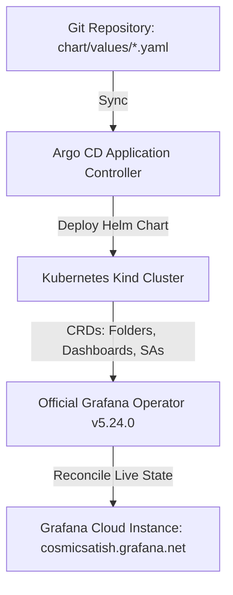

# Grafana Admin Platform GitOps

Enterprise declarative GitOps management platform for **Grafana Cloud** utilizing **Argo CD** and the official **Grafana Operator (`v5.24.0`)**.

---

## 🏛️ Architecture Overview



---

## 📁 Repository Structure

```text
├── chart/                              # Master Helm chart
│   ├── templates/                      # Standardized Kubernetes CRD templates
│   │   ├── Grafana.yaml                # Target Grafana Cloud Instance CR
│   │   ├── GrafanaFolder.yaml          # Nested Folders CRs (under Osttra)
│   │   ├── GrafanaDashboard.yaml       # Grafana Operator Observability Dashboard
│   │   ├── GrafanaServiceAccount.yaml  # Service Accounts & Dynamic 1-Yr Tokens
│   │   └── _helpers.tpl                # Standardized label helpers
│   └── values/                         # Pure Declarative Config (Source of Truth)
│       ├── Team.yaml                   # 39 Teams & Azure AD Object ID Sync
│       ├── GrafanaFolder.yaml          # Osttra Root + 41 Nested Folders & Permissions
│       ├── GrafanaServiceAccount.yaml  # 19 SAs with Fine-Grained Fixed Roles
│       ├── TeamLBACRule.yaml           # 25 Loki LBAC Stream Selectors
│       └── ResourcePermission.yaml     # Datasource Query Access Rules
├── deploy/
│   ├── argocd/                         # Argo CD GitOps Declarations
│   │   ├── application.yaml            # Argo CD Application
│   │   └── project.yaml                # Argo CD AppProject
│   ├── operator-values.yaml            # Grafana Operator Helm configuration
│   └── install.sh                      # Cluster bootstrap script
└── .github/workflows/
    ├── validate.yaml                   # Ultra-fast CI validation (9-11s)
    └── onboard.yaml                    # Automated team onboarding & safety checks
```

---

## 🚀 Getting Started & Argo CD Web UI

### 1. Access the Argo CD Web UI
```bash
kubectl port-forward svc/argocd-server -n argocd 8080:443
```
- **URL**: Open **[https://localhost:8080](https://localhost:8080)** in your browser.
- **Username**: `admin`
- **Password**:
  ```bash
  kubectl -n argocd get secret argocd-initial-admin-secret -o jsonpath="{.data.password}" | base64 -d && echo ""
  ```

---

## 🧪 Validations & CI Pipeline

Run all linting, schema validation, and guardrails locally:
```bash
make validate
```
